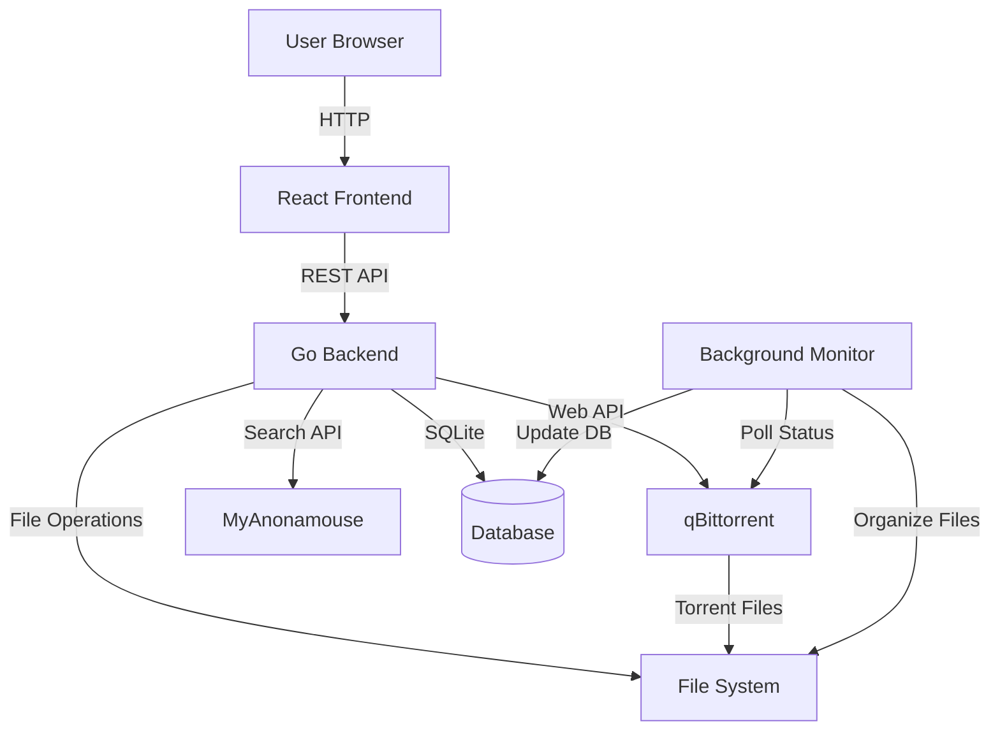
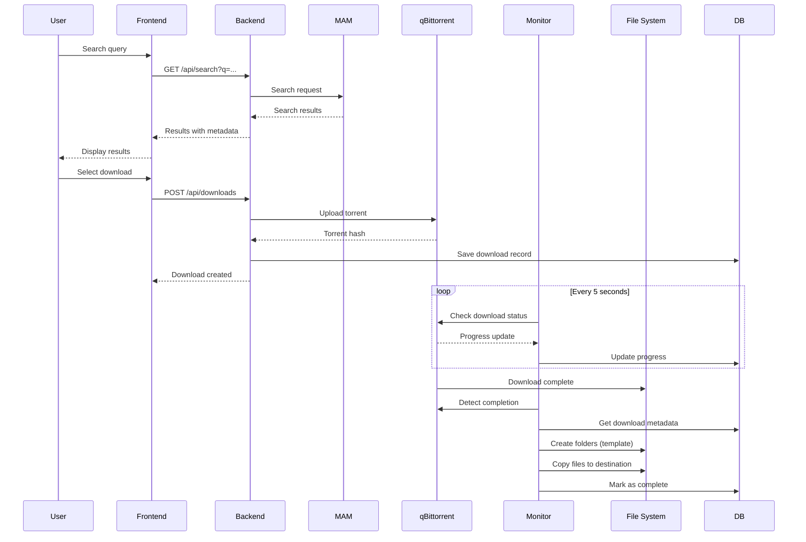
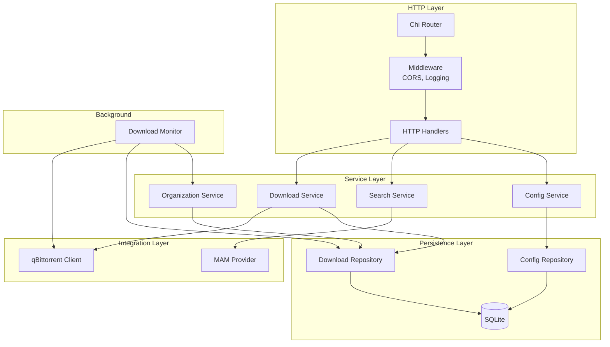
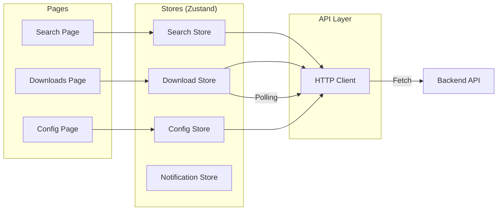

<objective>
Create architecture diagrams and deployment guide to complete developer documentation.

Purpose: Provide visual architecture overview for understanding system design and production deployment instructions.
Output: Architecture diagrams in docs/architecture/ and deployment guide in docs/DEPLOYMENT.md.
</objective>

<execution_context>
~/.claude/get-shit-done/workflows/execute-phase.md
./summary.md
</execution_context>

<context>
@.planning/PROJECT.md
@.planning/ROADMAP.md
@.planning/STATE.md
@.planning/codebase/ARCHITECTURE.md
@.planning/codebase/INTEGRATIONS.md
@.planning/codebase/STRUCTURE.md
@docs/architecture/ADR.md
@backend/internal/downloads/service.go
@backend/cmd/api/main.go

**Tech stack available:** Go 1.23, React 19, TypeScript 5.9, Vite 7, Chi router, SQLite, Zustand, TailwindCSS
**Established patterns:** Repository pattern, background monitor goroutine, REST API with typed errors
**Constraining decisions:**
- Phase 10: Architecture documentation lives in docs/architecture/
- Backend builds to single binary, frontend builds to static dist/

**Current state:** ADR exists with text descriptions of architecture, but no visual diagrams. No deployment documentation exists.
</context>

<tasks>

<task type="auto">
  <name>Task 1: Create architecture diagrams using Mermaid</name>
  <files>docs/architecture/DIAGRAMS.md</files>
  <action>Create architecture diagram document using Mermaid syntax (renders on GitHub):

**Create docs/architecture/DIAGRAMS.md with:**

1. **System Overview Diagram** - High-level components and data flow:


2. **Download Workflow Diagram** - Complete flow from search to organized files:


3. **Component Architecture Diagram** - Backend internal structure:


4. **Frontend State Management Diagram** - React/Zustand architecture:


**Each diagram includes:**
- Brief description above diagram explaining what it shows
- Legend if needed for special symbols/colors
- Note about technologies used in each component

**Avoid:** Over-detailed class diagrams (save for code), implementation details in high-level diagrams</action>
  <verify>cat docs/architecture/DIAGRAMS.md shows all 4 mermaid diagrams, markdown syntax correct, diagrams render on GitHub (mermaid syntax valid)</verify>
  <done>Architecture diagrams document exists with system overview, download workflow sequence, backend component architecture, frontend state management - all using Mermaid syntax that renders on GitHub</done>
</task>

<task type="auto">
  <name>Task 2: Create deployment guide</name>
  <files>docs/DEPLOYMENT.md</files>
  <action>Create production deployment guide:

**Structure:**

1. **Overview**
   - What deploying Organizr involves: Backend binary, frontend static files, SQLite database, qBittorrent instance
   - Architecture: Backend serves API on port 8080, frontend serves from any static host or backend, qBittorrent runs separately

2. **Prerequisites**
   - qBittorrent instance with Web UI enabled (can be same server or remote)
   - Linux server with systemd (for backend service)
   - Storage for audiobook files (local or network mount)

3. **Backend Deployment**
   ```bash
   # Build backend binary
   cd backend
   make build
   # Binary created at backend/organizr

   # Copy binary to server
   scp organizr user@server:/opt/organizr/

   # Create systemd service
   # (Include example service file)

   # Start service
   sudo systemctl enable organizr
   sudo systemctl start organizr
   ```

   Include full systemd service file example:
   ```ini
   [Unit]
   Description=Organizr Audiobook Automation
   After=network.target

   [Service]
   Type=simple
   User=organizr
   WorkingDirectory=/opt/organizr
   ExecStart=/opt/organizr/organizr
   Restart=on-failure

   [Install]
   WantedBy=multi-user.target
   ```

4. **Frontend Deployment**

   Option A: Serve from backend (simplest):
   ```bash
   # Build frontend
   cd frontend
   npm run build
   # Creates frontend/dist/

   # Copy to backend static directory
   # (Note: Backend currently doesn't serve static - would need update)
   # For now, recommend Option B
   ```

   Option B: Separate static host (nginx/caddy):
   ```bash
   # Build frontend
   npm run build

   # Copy dist/ to web server
   scp -r dist/* user@server:/var/www/organizr/

   # Configure nginx to serve files and proxy API calls
   # (Include example nginx config)
   ```

   Include nginx config example:
   ```nginx
   server {
       listen 80;
       server_name organizr.example.com;

       root /var/www/organizr;
       index index.html;

       # Frontend files
       location / {
           try_files $uri $uri/ /index.html;
       }

       # Proxy API to backend
       location /api/ {
           proxy_pass http://localhost:8080;
           proxy_set_header Host $host;
           proxy_set_header X-Real-IP $remote_addr;
       }
   }
   ```

5. **Database Setup**
   - SQLite database created automatically on first run at ./organizr.db
   - For persistence, ensure database file backed up regularly
   - Database location: Working directory of backend service
   - Backup: `sqlite3 organizr.db ".backup organizr-backup.db"`

6. **Configuration**
   - After deployment, configure qBittorrent connection via API or UI
   - Set destination path for organized files
   - Configure path templates
   - Link to backend/docs/CONFIGURATION.md for details

7. **Environment Variables**
   - Frontend: Update VITE_API_URL in .env.production before build if backend on different host
   - Backend: No environment variables currently - uses database config
   - Future: May add DATABASE_PATH, PORT env vars

8. **Docker Deployment (Future)**
   - Note: Docker support not yet implemented
   - Would require: Backend Dockerfile, Frontend build in multi-stage, docker-compose.yml
   - Tracked as potential future enhancement

9. **Health Checks**
   - Backend health: `curl http://localhost:8080/api/health`
   - Frontend: Check if index.html loads
   - qBittorrent: Check connection test in UI

10. **Troubleshooting**
    - Link to docs/TROUBLESHOOTING.md
    - Common deployment issues: Port conflicts (8080 in use), qBittorrent not accessible, database permissions, frontend can't reach backend (CORS/proxy)

**Avoid:** Docker instructions (not yet implemented), complex orchestration (overkill for this tool), platform-specific details beyond Linux/systemd</action>
  <verify>cat docs/DEPLOYMENT.md shows all sections, includes working systemd and nginx examples, provides clear production deployment path</verify>
  <done>Deployment guide exists with backend binary deployment, systemd service example, frontend static hosting with nginx config, database setup, configuration steps, health checks</done>
</task>

</tasks>

<verification>
Before declaring phase complete:
- [ ] docs/architecture/DIAGRAMS.md exists with all 4 mermaid diagrams
- [ ] All mermaid diagrams have valid syntax (check for balanced braces, correct arrows)
- [ ] docs/DEPLOYMENT.md exists with complete deployment instructions
- [ ] systemd service file example is complete and valid
- [ ] nginx config example is complete and valid
- [ ] All documentation cross-references are correct (links to CONFIGURATION, TROUBLESHOOTING, ADR)
</verification>

<success_criteria>

- All tasks completed
- Architecture diagrams provide visual overview of system (overview, workflow, backend, frontend)
- Deployment guide covers production deployment for both backend and frontend
- systemd and nginx examples are production-ready
- Documentation complete enough for experienced developer to deploy Organizr in production
</success_criteria>

<output>
After completion, create `.planning/phases/13-developer-documentation/13-02-SUMMARY.md`:

---
phase: 13-developer-documentation
plan: 02
subsystem: documentation
tags: [documentation, architecture, diagrams, deployment, devops]

# Dependency graph
requires:
  - phase: 13
    plan: 01
    provides: Root README, troubleshooting guide
provides:
  - Architecture diagrams (mermaid) showing system design
  - Production deployment guide with systemd and nginx examples
affects: [14-code-quality-tools]

# Tech tracking
tech-stack:
  added: []
  patterns: [mermaid-diagrams, systemd-service, nginx-reverse-proxy]

key-files:
  created:
    - docs/architecture/DIAGRAMS.md
    - docs/DEPLOYMENT.md
  modified: []

key-decisions:
  - "Mermaid diagrams for architecture (renders on GitHub, version control friendly)"
  - "systemd for backend service management (standard on Linux)"
  - "nginx reverse proxy for frontend static hosting + API proxying"

patterns-established:
  - "Four-diagram architecture suite: system overview, workflow sequence, component graph, frontend state"
  - "Deployment guide structure: prerequisites → backend → frontend → database → config → health checks"

---

# Phase 13 Plan 2: Architecture Diagrams and Deployment Summary

**Visual architecture documentation and production deployment guide completed**

## Accomplishments

- Created architecture diagrams using Mermaid: system overview, download workflow sequence, backend components, frontend state management
- Created production deployment guide with systemd service and nginx reverse proxy examples
- Documented database setup and backup procedures
- Added health check endpoints and troubleshooting references
- Complete developer documentation suite now available

## Files Created/Modified

- `docs/architecture/DIAGRAMS.md` - Four mermaid diagrams showing system architecture visually
- `docs/DEPLOYMENT.md` - Production deployment guide with systemd and nginx configuration examples

## Decisions Made

- Use Mermaid for diagrams (GitHub-native rendering, version control friendly)
- systemd for backend service management (standard on modern Linux)
- nginx for frontend static hosting with reverse proxy to backend API

## Issues Encountered

None

## Next Step

Phase 13 (Developer Documentation) complete. Ready for Phase 14 (Code Quality Tools) - linting, pre-commit hooks, CI improvements.
</output>
