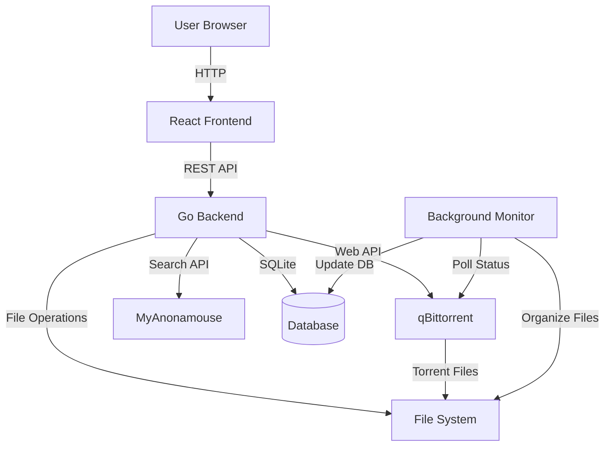
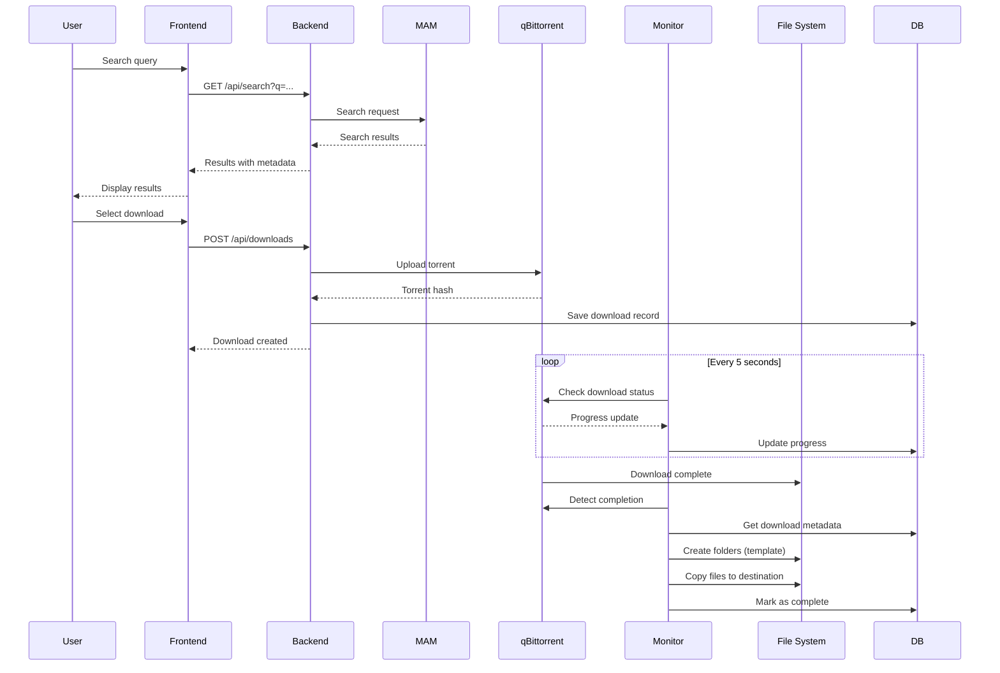
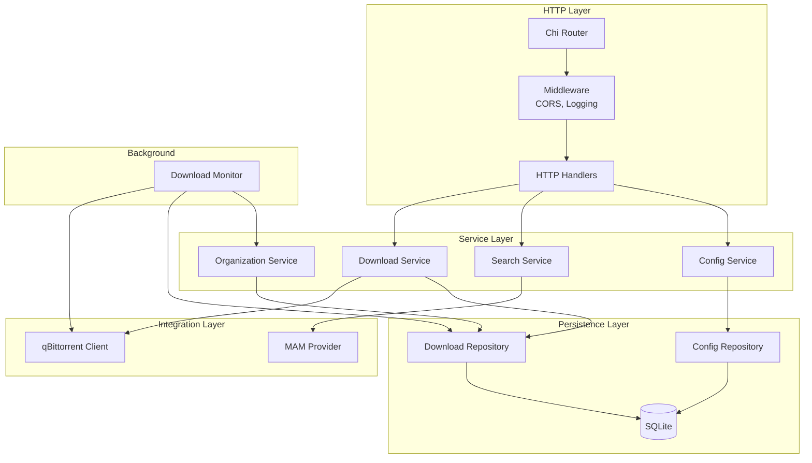
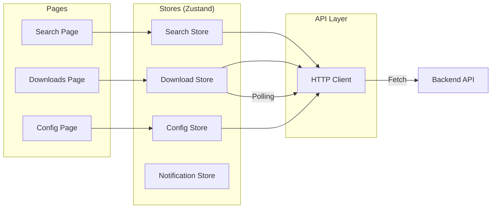

# Architecture Diagrams

This document provides visual representations of Organizr's system architecture using Mermaid diagrams. These diagrams render automatically on GitHub and help understand the system design at various levels.

---

## 1. System Overview

This high-level diagram shows the main components and how data flows through the system.

**Components:**
- **React Frontend** - Single-page application built with React 19, TypeScript, and Vite
- **Go Backend** - REST API server with Chi router, serves port 8080
- **qBittorrent** - Torrent client with Web UI (can be local or remote)
- **MyAnonamouse** - Private audiobook tracker providing search API
- **SQLite Database** - Persistent storage for downloads, configuration, and state
- **File System** - Storage for downloaded and organized audiobook files
- **Background Monitor** - Goroutine polling qBittorrent every 5 seconds for status updates

---

## 2. Download Workflow

This sequence diagram shows the complete flow from user search to organized files.

**Key Flows:**
1. **Search** - User queries MAM API through backend proxy (preserves privacy)
2. **Download** - Backend uploads torrent to qBittorrent and records in database
3. **Monitoring** - Background goroutine polls qBittorrent continuously for progress
4. **Organization** - On completion, monitor uses template system to organize files

---

## 3. Backend Component Architecture

This diagram shows the internal structure of the Go backend using layered architecture.

**Layers:**
- **HTTP Layer** - Request routing, middleware (CORS, logging), validation
- **Service Layer** - Business logic, orchestrates operations across repositories and clients
- **Integration Layer** - External service clients (qBittorrent Web API, MAM Search API)
- **Persistence Layer** - Repository pattern with SQLite implementation (interface-based for testing)
- **Background** - Monitor goroutine for continuous status polling and auto-organization

**Design Pattern:** Repository pattern with dependency injection enables comprehensive testing with mock implementations.

---

## 4. Frontend State Management

This diagram shows React component structure and Zustand state management.

**Frontend Architecture:**
- **Pages** - Route-level components (React Router), coordinate page-level state
- **Stores** - Zustand stores for global state, hooks-based API (`useDownloadStore`, `useSearchStore`, etc.)
- **API Client** - Centralized HTTP abstraction with error handling and timeout support
- **Polling** - Download store automatically polls backend every 3 seconds when downloads active (auto-stops when idle)

**State Management:** Zustand provides minimal-boilerplate state management with selector-based subscriptions for performance.

---

## Additional Documentation

- **Architecture Decision Record (ADR)** - See `docs/architecture/ADR.md` for detailed rationale behind major technical decisions
- **Codebase Analysis** - See `.planning/codebase/ARCHITECTURE.md` for code-level architecture documentation
- **Integration Details** - See `.planning/codebase/INTEGRATIONS.md` for external service integration patterns

---

*Generated: 2026-01-09*
*Project: Organizr v1.2*
